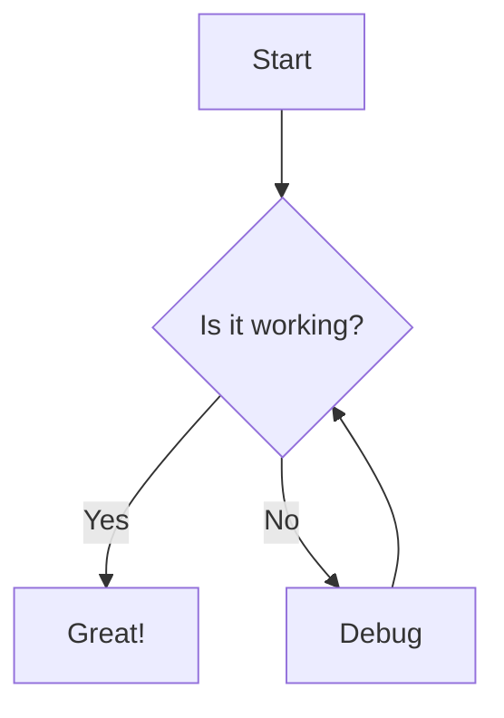
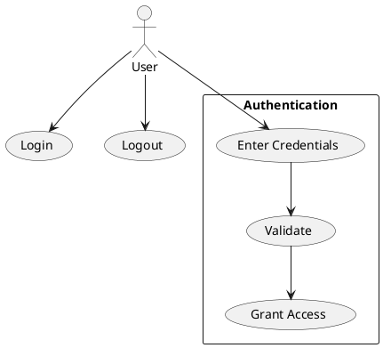

# Konsensus Flow Documentation

## Table of Contents
1. [Introduction](#introduction)
2. [Getting Started](#getting-started)
3. [Creating Files](#creating-files)
4. [File Types](#file-types)
5. [Project Management](#project-management)
6. [Preview Modes](#preview-modes)
7. [Exporting Diagrams](#exporting-diagrams)
8. [Keyboard Shortcuts](#keyboard-shortcuts)
9. [Troubleshooting](#troubleshooting)

## Introduction

Konsensus Flow is a web-based diagram editor that allows you to create, edit, and visualize diagrams using popular markup languages. The application provides a familiar VS Code-like interface for managing your diagram projects.

## Getting Started

### First Time Setup
1. Open the application in your web browser
2. The application works entirely in the browser - no installation required
3. Your work is automatically saved to browser storage

### Interface Overview
- **File Tree**: Left sidebar showing project structure
- **Editor**: Main area for writing diagram code
- **Preview Panel**: Right side showing rendered diagrams
- **Menu Bar**: Top navigation with file operations

## Creating Files

### Method 1: Menu Bar
1. Click "File" in the menu bar
2. Select "New File" or use Ctrl+N
3. Choose file type from the modal dialog
4. Select location in the project structure
5. Enter filename and start writing

### Method 2: Context Menu
1. Right-click on a folder in the file tree
2. Select "New File" from context menu
3. Follow steps 3-5 above

### Method 3: Tree Menu
1. Click the "⋯" menu next to any folder
2. Select "New File"
3. Follow steps 3-5 above

## File Types

### Mermaid Diagrams (.mmd)
Mermaid is a JavaScript-based diagramming tool that renders text definitions into diagrams.

**Supported Diagram Types:**
- Flowcharts
- Sequence diagrams
- Gantt charts
- Class diagrams
- State diagrams
- And more...

**Example:**


### PlantUML Diagrams (.puml)
PlantUML is a component that allows you to create diagrams from textual descriptions.

**Supported Diagram Types:**
- UML diagrams
- Sequence diagrams
- Use case diagrams
- Activity diagrams
- Component diagrams

**Example:**


### Plain Text Files (.txt)
Simple text files for notes, documentation, or any plain text content.

### Markdown Files (.md)
Markdown files with live HTML preview support.

**Features:**
- Headers (# ## ###)
- Lists (- * numbered)
- Code blocks (```)
- Links [text](url)
- Images 
- Tables
- And more...

## Project Management

### Creating Folders
1. Right-click in file tree or use folder menu
2. Select "New Folder"
3. Enter folder name

### Renaming Items
- **Method 1**: Double-click on file/folder name in tree
- **Method 2**: Right-click → Rename
- **Method 3**: Select item → press F2

### Deleting Items
1. Select file/folder
2. Press Delete key or right-click → Delete
3. Confirm deletion

## Preview Modes

The preview panel can display content in different modes:

### Auto-detect (Default)
Automatically detects file type and renders accordingly.

### Manual Override
Use the dropdown in preview panel header to force rendering mode:
- **Mermaid**: Force Mermaid rendering
- **PlantUML**: Force PlantUML rendering
- **Plain Text**: Show as plain text
- **Markdown**: Render as HTML

## Exporting Diagrams

### SVG Export
1. Open diagram file
2. Right-click file in tree → Download SVG
3. Or use main menu: File → Export → SVG

### PNG Export
1. Open diagram file
2. Right-click file in tree → Download PNG
3. Or use main menu: File → Export → PNG

**Note**: PNG export may take longer as it renders SVG to canvas first.

## Keyboard Shortcuts

| Shortcut | Action |
|----------|--------|
| Ctrl+S | Save current file |
| Ctrl+N | New file |
| F2 | Rename selected item |
| Delete | Delete selected item |
| Ctrl+Z | Undo (in editor) |
| Ctrl+Y | Redo (in editor) |

## Troubleshooting

### Diagrams Not Rendering
1. Check syntax errors in your code
2. Ensure correct file extension
3. Try switching preview mode manually
4. Check browser console for errors

### Files Not Saving
1. Ensure browser storage is enabled
2. Try refreshing the page
3. Check browser console for storage errors

### Performance Issues
1. Large diagrams may render slowly
2. Try breaking complex diagrams into smaller files
3. Close unused browser tabs

### Browser Compatibility
- **Recommended**: Chrome 90+, Firefox 88+, Safari 14+
- **Minimum**: Any modern browser with ES6 support

## Advanced Features

### Custom Themes
Modify `styles.css` to customize the appearance.

### Extensions
The application is built with modular architecture, making it extensible for additional diagram types.

### API Integration
Future versions may include API endpoints for diagram generation.

## Contributing

This is an open-source project. Contributions are welcome!

## License

MIT License - see LICENSE file for details.

## Support

For support and questions:
- Check this documentation
- Review example files in the project
- Check browser console for error messages

---

**Last updated:** October 2024
**Version:** 1.0.0
