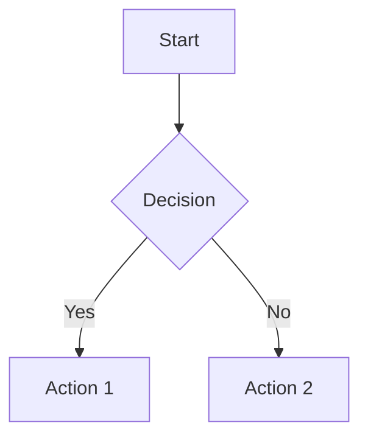
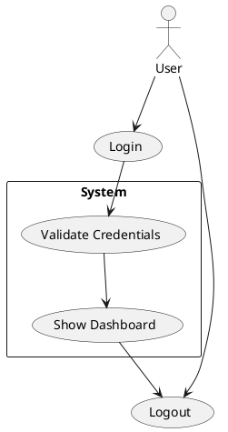

# Konsensus Flow - Diagram IDE

A powerful VS Code-style diagram viewer and editor built with native JavaScript, designed for creating and visualizing diagrams with ease.

## Features

- **Multiple Diagram Types**: Support for Mermaid and PlantUML diagrams
- **Real-time Preview**: Live rendering as you type
- **File Management**: Create, edit, and organize diagram files in a project structure
- **Modern UI**: VS Code-inspired interface with dark/light theme support
- **Export Options**: Download diagrams as SVG or PNG
- **Markdown Support**: Render and preview Markdown files
- **Context Menus**: Right-click menus for quick actions
- **AI Assistant**: Built-in Gemini chatbot that can draft diagrams or docs directly into the editor
- **Enhanced Preview**: Improved Mermaid/PlantUML rendering with fullscreen zoom and better scaling

## Quick Start

1. **Create a New File**: Use the "New File" option from the menu or context menu
2. **Choose File Type**: Select from Mermaid, PlantUML, Plain Text, or Markdown
3. **Start Writing**: Begin typing your diagram code or content
4. **Preview**: See real-time rendering in the preview panel
5. **Save**: Your work is automatically saved
6. **Use the AI Assistant (Optional)**: Open the chatbot panel, ask Gemini for a diagram snippet, and it will overwrite the editor with the generated code

> Chatbot replies replace the entire editor content. Save your work or duplicate the file before inserting new AI-generated snippets.

## AI Assistant (Gemini)

- Configure your Gemini API key and model in `js/config.js`:

```javascript
const CONFIG = {
    GEMINI_API_KEY: 'your-key-here',
    GEMINI_MODEL: 'gemini-2.0-flash',
    GEMINI_BASE_URL: 'https://generativelanguage.googleapis.com/v1beta',
    SITE_URL: 'http://127.0.0.1:5500/editor.html',
    SITE_NAME: 'Konsensus Flow - Professional Diagram IDE'
};
```

- The chatbot lives in the right sidebar. Toggle it from the toolbar, submit a prompt, and the response will be rendered in the chat pane and copied into the Ace editor.
- Fullscreen mode is available for longer chats.
- The integration uses the `generateContent` endpoint (`/models/{model}:generateContent`). Ensure your API key has access to the selected model.

## Supported Formats

### Mermaid Diagrams


### PlantUML Diagrams


### Markdown Files
Supports standard Markdown syntax with live preview.

## Keyboard Shortcuts

- `Ctrl+S`: Save current file
- `F2` or Double-click: Rename files/folders inline
- `Delete`: Delete selected items

## Project Structure

Organize your diagrams in folders and subfolders for better project management.

## Export Options

- **SVG**: Vector format, perfect for web and print
- **PNG**: Raster format with transparency support

## Browser Support

Works in all modern browsers including Chrome, Firefox, Safari, and Edge.

---

Built with ❤️ using native JavaScript and Bootstrap 5
