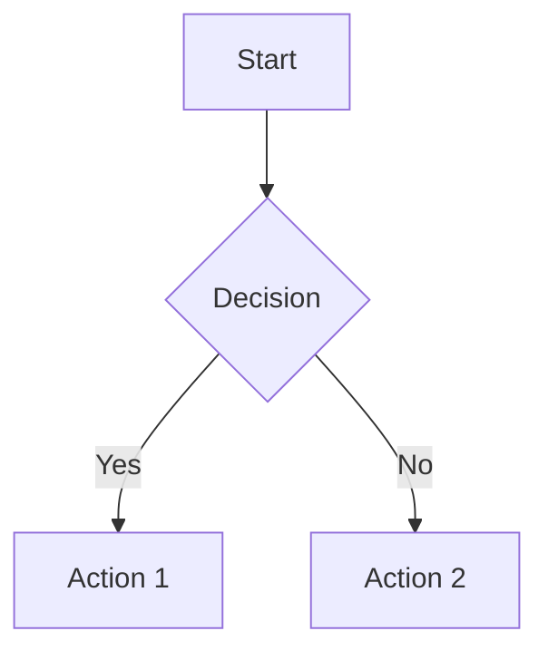
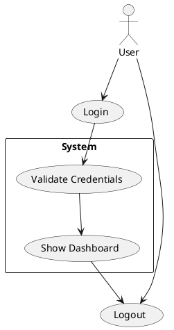

# Konsensus Flow - Diagram IDE

A powerful VS Code-style diagram viewer and editor built with native JavaScript, designed for creating and visualizing diagrams with ease.

## Features

- **Multiple Diagram Types**: Support for Mermaid and PlantUML diagrams
- **Real-time Preview**: Live rendering as you type
- **File Management**: Create, edit, and organize diagram files in a project structure
- **Modern UI**: VS Code-inspired interface with dark/light theme support
- **Export Options**: Download diagrams as SVG or PNG
- **Markdown Support**: Render and preview Markdown files
- **Context Menus**: Right-click menus for quick actions

## Quick Start

1. **Create a New File**: Use the "New File" option from the menu or context menu
2. **Choose File Type**: Select from Mermaid, PlantUML, Plain Text, or Markdown
3. **Start Writing**: Begin typing your diagram code or content
4. **Preview**: See real-time rendering in the preview panel
5. **Save**: Your work is automatically saved

## Supported Formats

### Mermaid Diagrams

### PlantUML Diagrams

### Markdown Files
Supports standard Markdown syntax with live preview.

## Keyboard Shortcuts

- `Ctrl+S`: Save current file
- `F2` or Double-click: Rename files/folders inline
- `Delete`: Delete selected items

## Project Structure

Organize your diagrams in folders and subfolders for better project management.

## Export Options

- **SVG**: Vector format, perfect for web and print
- **PNG**: Raster format with transparency support

## Browser Support

Works in all modern browsers including Chrome, Firefox, Safari, and Edge.

---

Built with ❤️ using native JavaScript and Bootstrap 5
